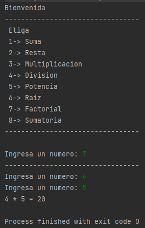

# TECSUP-PM-2021-2-B
PROGRAMACIÓN DE APLICACIONES MÓVILES
LABORATORIO N° 03 : POO EN KOTLIN
NOMBRE : NIKOLL BONILLA

Se crearon dos interfaces **OperacionesBasicas** y **OperacionesAvanzadas**, y dos clases que las implementan **ImplementacionOperacionesBasicas** y **ImplementacionOperacionesAvanzadas**, respectivamente. 

Tambien se invoco a **OperacionesBasicas** desde **ImplementacionOperacionesAvanzadas**.

Se implemento un **menu** para acceder a cada una de las funciones implementadas.

